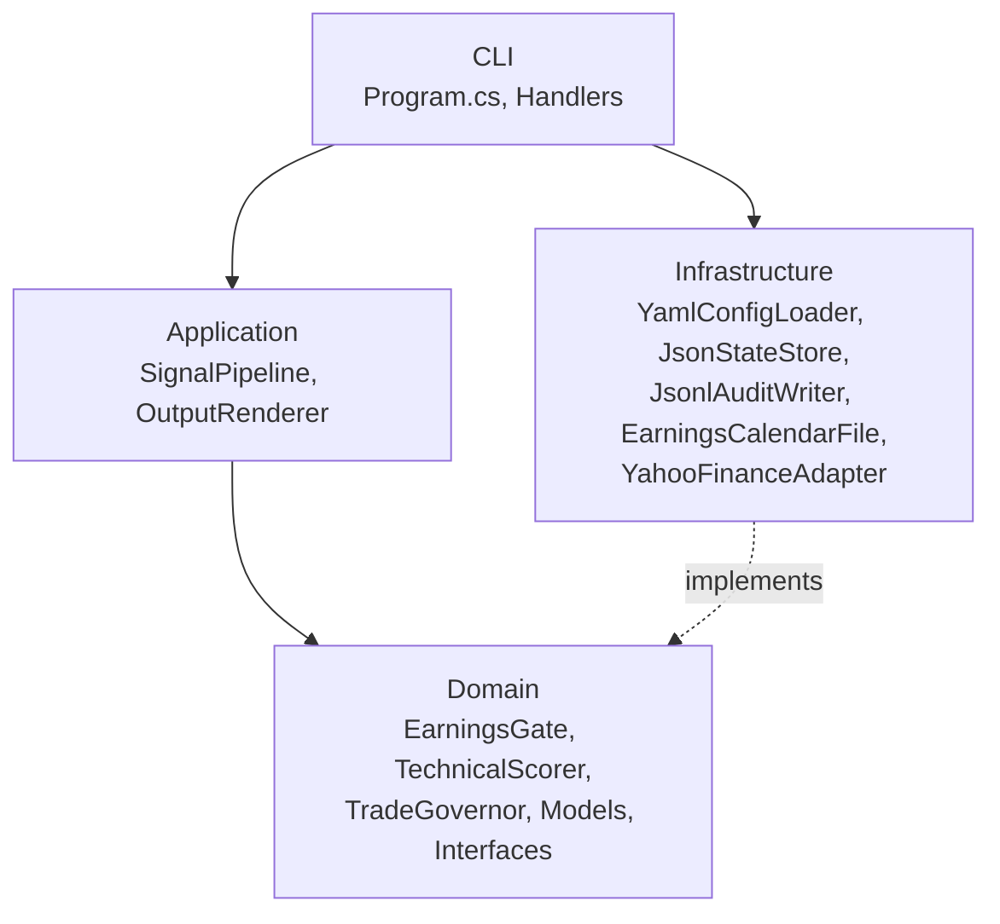
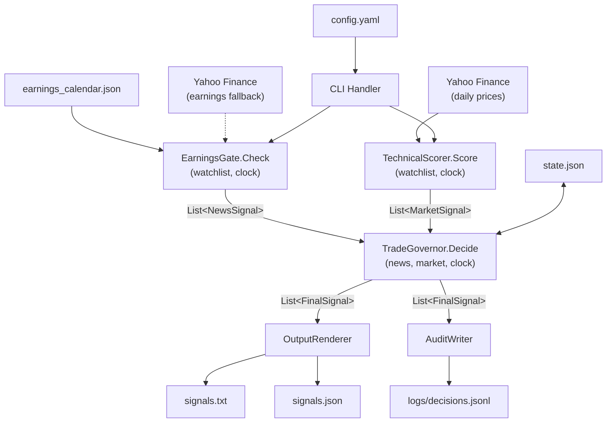

# C# Architecture

## Architecture

The C# application is a synchronous, single-process CLI that generates manual trading signals for a small equity watchlist. It replaces the Python `signals-bot` with identical behavior and cleaner structure.

The system follows a pipeline architecture: configuration flows in, three domain services execute in sequence (earnings gate, technical scoring, trade governance), and results flow out to files. There is no API, no scheduler, no background processing. Each invocation runs to completion and exits.

The codebase is organized into four projects following a simplified layered architecture:

- **Domain** — enums, signal models, computation logic, service interfaces
- **Infrastructure** — file I/O, Yahoo Finance adapter, config parsing
- **Application** — pipeline orchestration, output rendering
- **CLI** — entry point, command parsing, dependency wiring



## Architectural Goals

1. **Behavioral parity.** Every signal-producing code path must match the Python implementation's output for identical inputs. The SMA-based RSI calculation, scoring thresholds, gating priority, and policy enforcement order are non-negotiable.

2. **Fail-safe by default.** Every error condition in every component defaults to WAIT. Never emit BUY or SELL on failure. This is a safety-critical invariant.

3. **Testability without network access.** All external data sources (Yahoo Finance, filesystem) are behind interfaces. Domain logic is pure and testable with constructed inputs, and Yahoo-specific transport or parsing behavior should sit behind small internal seams so the adapter can be validated offline.

4. **Single responsibility per file.** Each class does one thing. No god classes, no duplicated logic between commands.

5. **Minimal abstraction.** No dependency injection containers, no mediator patterns, no event buses. Constructor injection with manual wiring in the CLI entry point.

## System Overview

Five CLI commands cover all workflows:

| Command | Purpose | Data Dependencies |
|---------|---------|-------------------|
| `check-calendar` | Validate earnings calendar completeness | Local calendar, config |
| `stats-periods` | Analyze BUY-to-SELL holding periods | Audit JSONL |
| `run-asof` | Simulate signals for a historical date | Yahoo Finance, calendar, config, state |
| `run-realtime` | Generate live signals for today | Yahoo Finance, calendar, config, state |
| `run-range` | Batch simulation across a date range | Same as run-asof, looped in-process |

All commands are synchronous and single-process. `run-range` loops dates in-process rather than spawning subprocesses.

## Core Modules

### Domain Layer

**Enums**

- `NewsState`: TRADE_OK, WAIT, NO_TRADE, MANAGE, EXIT_RECOMMENDED, EXIT_NOW
- `Action`: BUY, SELL, WAIT, IGNORE, MANAGE, EXIT_RECOMMENDED, EXIT_NOW
- MANAGE, EXIT_RECOMMENDED, EXIT_NOW are defined but never emitted. They exist for forward compatibility.

**Signal Models**

- `NewsSignal` — ticker, state, reason, timestamp. No `valid_until` (unused in Python, omitted here).
- `MarketSignal` — ticker, action, score, close, SMA50, SMA200, RSI14, reason, timestamp.
- `FinalSignal` — ticker, action, news state, market action, reason, timestamp.

**Service Interfaces**

- `IEarningsCalendar` — load and query earnings dates from the local calendar.
- `IMarketDataProvider` — retrieve daily OHLCV price history for a ticker.
- `IClock` — provides current UTC time; injectable for deterministic testing and as-of simulation.
- `ITradeGovernorStateStore` — load and save trade governor state (buy count, last buy timestamp). Implemented by `JsonStateStore`.

**Domain Services**

- `EarningsGate` — checks earnings proximity against the local calendar. Falls back to Yahoo Finance via `IMarketDataProvider` when a ticker is absent from the local calendar. Returns NewsSignal per ticker.
- `TechnicalScorer` — computes SMA50, SMA200, RSI14 from daily closes. Scores and emits MarketSignal per ticker. All calculations use simple moving averages (rolling mean), not EMA/Wilder's smoothing.
- `TradeGovernor` — merges NewsSignals and MarketSignals into FinalSignals. Applies gating priority and policy constraints (max buys per day, cooldown, news TTL). Processes tickers in alphabetical order. A NewsSignal older than `news_ttl_minutes` (default: 180) is treated as stale and produces WAIT with reason `DATA_STALE`.

### Infrastructure Layer

- `YamlConfigLoader` — parses `config.yaml` into a strongly-typed `AppConfig` object.
- `JsonStateStore` — reads/writes `state.json` (fields: `day`, `buys_today`, `last_buy_at`). Auto-resets on day change. Silently resets on corruption or missing file. Implements `ITradeGovernorStateStore`.
- `JsonlAuditWriter` — appends JSONL rows to the audit log. Append-only, never truncates.
- `JsonlAuditReader` — reads and parses JSONL audit files for stats-periods analysis.
- `EarningsCalendarFile` — implements `IEarningsCalendar` by loading `earnings_calendar.json`.
- `YahooFinanceAdapter` — implements `IMarketDataProvider` via a verified Yahoo integration path. Retrieves up to 365 days of daily OHLCV for technical scoring and next earnings dates for fallback use when the local calendar lacks a ticker. The adapter owns provider-specific request shaping, boundary clamping, timestamp normalization, and exception propagation. The exact Yahoo library or HTTP strategy is an implementation detail until live verification passes.

### Application Layer

- `SignalPipeline` — orchestrates the three-service pipeline: earnings gate, technical scorer, trade governor. Normalizes the watchlist (trim, uppercase) and deduplicates tickers before passing them to services. Single method: `Run(watchlist, clock) -> List<FinalSignal>`.
- `OutputRenderer` — formats and writes `signals.txt` and `signals.json`. Single implementation shared by all commands. Uses plain enum strings (`"BUY"`) in JSON output and prefixed strings (`"Action.BUY"`) in text output. `JsonlAuditWriter` uses the same prefixed format (`"Action.BUY"`, `"NewsState.TRADE_OK"`) in audit JSONL output.

### CLI Layer

- `Program.cs` — entry point. Parses commands and arguments, wires dependencies, delegates to the appropriate command handler.
- One handler class per command: `CheckCalendarHandler`, `StatsPeriodsHandler`, `RunAsOfHandler`, `RunRealtimeHandler`, `RunRangeHandler`.

## Data Flow



## Configuration and State Management

### Configuration

A single `config.yaml` file defines all runtime parameters:

```yaml
watchlist: [AAPL, MSFT, NVDA, TSLA]
news:
  local_earnings_calendar: earnings_calendar.json
  block_window_hours: 48
policy:
  max_buys_per_day: 99999999  # sample value; code default when omitted is int.MaxValue
  cooldown_minutes: 0
output:
  text_file: signals.txt
  json_file: signals.json
state:
  path: data/state.json
audit:
  jsonl_path: logs/decisions.jsonl
```

Loaded once at startup into a strongly-typed `AppConfig` record. No hot-reload, no environment variable overrides. The `max_buys_per_day` value above is a sample; when the field is omitted from config, the code defaults to `int.MaxValue` (effectively unlimited).

### State

`JsonStateStore` manages a single JSON file:

```json
{ "day": "2026-03-07", "buys_today": 1, "last_buy_at": "2026-03-07T14:30:00Z" }
```

Behavior:
- On load, compares `day` against the current date from `IClock`. If different, resets `buys_today` to 0 and clears `last_buy_at`.
- Corrupted or missing files silently reset to empty state (day=today, buys=0, no last_buy).
- Live and simulation modes use separate state files. Simulation never touches live state.

**Decision: state reset clock.** The Python implementation uses the real UTC clock for day-reset even during simulation. The C# implementation will use `IClock`, which means simulation mode will use `as_of` for day-reset. This fixes the Python bug and may produce different buy counts during backtests compared to the Python version. This is an accepted divergence.

### Live vs Simulation Isolation

| Concern | Live | Simulation |
|---------|------|------------|
| State file | `data/state.json` | `data/sim_state.json` (or custom path) |
| Audit file | `logs/decisions.jsonl` | `logs/sim_decisions.jsonl` (or custom path) |
| Output files | `signals.txt`, `signals.json` | `asof_{date}.signals.txt`, `asof_{date}.signals.json` |
| Clock | Wall-clock UTC | Fixed `as_of` datetime |

## Logging and Error Handling

### Error Handling

**Fail-safe invariant:** every catch block in every domain service produces WAIT. No exception path may emit BUY or SELL.

| Component | On Exception | Signal |
|-----------|-------------|--------|
| EarningsGate | Any exception during calendar lookup or Yahoo fallback | WAIT with reason `DATA_ERROR` |
| TechnicalScorer | Any exception during price download or calculation | WAIT with reason `MARKET_DATA_ERROR` |
| TradeGovernor | Missing or stale news signal for a ticker | WAIT with reason `NO_NEWS_STATE` or `DATA_STALE` |
| JsonStateStore | Corrupt or missing file | Silent reset to empty state |

No retry logic. If Yahoo Finance fails, the ticker gets WAIT for that run.

### Logging

Structured logging via `Microsoft.Extensions.Logging` with console output. Log levels:

- **Information** — pipeline start/completion, per-ticker signal summary
- **Warning** — Yahoo Finance fallback used, state file reset, calendar expiry
- **Error** — exception caught (with stack trace), data retrieval failure

No log files. Console output only. The JSONL audit log serves as the persistent record.

### Exit Codes

| Command | Success | Failure |
|---------|---------|---------|
| `check-calendar` | 0 (all tickers valid) | 2 (any ticker expired or missing) |
| All others | 0 | 1 (unhandled exception) |

## Infrastructure Components

### Yahoo Finance Adapter

Implements `IMarketDataProvider` via a verified Yahoo integration path. Responsibilities:
- Download approximately 365 days of daily OHLCV data for a ticker up to a given date.
- Retrieve the next earnings date for fallback use when the local calendar does not contain the ticker.
- Clamp provider-invalid future end boundaries and handle endpoint-specific inclusive or exclusive date rules explicitly.
- Map provider responses to `PriceBar[]` ordered chronologically with deliberate timestamp normalization.
- Keep the adapter boundary synchronous if the final implementation still fits the application's synchronous design.

No retry logic. No caching by default. Failures propagate as exceptions to be caught by the calling domain service. Provider-specific transport or parsing helpers may be introduced internally, but `YahooFinanceAdapter` remains the public `IMarketDataProvider` entry point.

### Earnings Calendar File

Implements `IEarningsCalendar`. Reads `earnings_calendar.json` — a manually maintained JSON file mapping ticker symbols to arrays of date strings. Parsed once per run.

### Clock Abstraction

`IClock` with two implementations:
- `SystemClock` — returns `DateTime.UtcNow`. Used in live mode.
- `FixedClock` — returns a fixed `DateTime`. Used in simulation mode and tests.

This is the only abstraction introduced purely for testability. It also cleanly separates live vs simulation time, fixing the Python state-reset bug.

## Project Structure

```
BlowingCandles/
├── BlowingCandles.sln
├── src/
│   ├── BlowingCandles.Domain/
│   │   ├── Enums/
│   │   │   ├── Action.cs
│   │   │   └── NewsState.cs
│   │   ├── Models/
│   │   │   ├── NewsSignal.cs
│   │   │   ├── MarketSignal.cs
│   │   │   ├── FinalSignal.cs
│   │   │   ├── AuditRecord.cs
│   │   │   ├── HoldingPeriod.cs
│   │   │   ├── HoldingPeriodAnalysis.cs
│   │   │   ├── OpenPosition.cs
│   │   │   └── TradeGovernorState.cs
│   │   ├── Interfaces/
│   │   │   ├── IClock.cs
│   │   │   ├── IEarningsCalendar.cs
│   │   │   ├── IMarketDataProvider.cs
│   │   │   └── ITradeGovernorStateStore.cs
│   │   └── Services/
│   │       ├── EarningsGate.cs
│   │       ├── TechnicalScorer.cs
│   │       ├── TradeGovernor.cs
│   │       └── HoldingPeriodCalculator.cs
│   ├── BlowingCandles.Infrastructure/
│   │   ├── Config/
│   │   │   ├── AppConfig.cs
│   │   │   └── YamlConfigLoader.cs
│   │   ├── Clock/
│   │   │   ├── SystemClock.cs
│   │   │   └── FixedClock.cs
│   │   ├── State/
│   │   │   └── JsonStateStore.cs
│   │   ├── Audit/
│   │   │   ├── JsonlAuditWriter.cs
│   │   │   ├── JsonlAuditReader.cs
│   │   │   └── AuditReadResult.cs
│   │   ├── Calendar/
│   │   │   └── EarningsCalendarFile.cs
│   │   └── MarketData/
│   │       └── YahooFinanceAdapter.cs
│   ├── BlowingCandles.Application/
│   │   ├── SignalPipeline.cs
│   │   └── OutputRenderer.cs
│   └── BlowingCandles.Cli/
│       ├── Program.cs
│       └── Handlers/
│           ├── CheckCalendarHandler.cs
│           ├── StatsPeriodsHandler.cs
│           ├── RunCommandSupport.cs
│           ├── RunAsOfHandler.cs
│           ├── RunRealtimeHandler.cs
│           └── RunRangeHandler.cs
├── tests/
│   ├── BlowingCandles.Domain.Tests/
│   ├── BlowingCandles.Infrastructure.Tests/
│   ├── BlowingCandles.Application.Tests/
│   ├── BlowingCandles.CrossValidation.Tests/
│   │   ├── FixtureMarketDataProvider.cs
│   │   ├── ComparisonHelpers.cs
│   │   └── GoldenOutputTests.cs
│   └── fixtures/
│       └── cross-validation/
│           ├── mixed-actions/
│           ├── all-wait/
│           └── empty-watchlist/
├── config.yaml
├── earnings_calendar.json
├── .dockerignore
├── docker-entrypoint.sh
└── Dockerfile
```

## Implementation Order

### Phase 1: Project Scaffold and Calendar Validator

Build the solution structure, YAML config loader, earnings calendar reader, clock abstraction, and the `check-calendar` command. This phase is deterministic with no external data dependencies.

**Deliverables:** Working `check-calendar` command with stdout and exit-code parity against Python output.

### Phase 2: Audit Analysis

Build the JSONL audit reader and the `stats-periods` command. Read-only and deterministic. Validates the audit file contract that later phases will write to.

**Deliverables:** Working `stats-periods` command matching Python output for known audit fixtures.

### Phase 3: Shared Infrastructure

Build the full config loader, JSON state store (with day-reset logic), JSONL audit writer, and output renderer. Every remaining capability depends on this infrastructure.

**Deliverables:** Unit-tested state reset behavior, enum serialization, and output formatting.

### Phase 4: Trade Governor

Build the trade governor domain logic: news gating, market action pass-through, buy limits, cooldown. Pure domain logic testable with constructed inputs.

**Deliverables:** Passing tests for each gate and policy constraint.

### Phase 5: Earnings Gate

Build the earnings proximity checking logic using the local calendar reader from Phase 1. Add the Yahoo Finance earnings fallback behind `IMarketDataProvider`.

**Deliverables:** Unit tests with fixture calendars covering all NewsState outcomes.

### Phase 6: Technical Scoring

Build the SMA50, SMA200, and RSI14 calculations using simple moving averages. This is the most numerically sensitive component. Price retrieval goes behind `IMarketDataProvider`.

**Deliverables:** Unit tests with captured price fixtures verifying SMA and RSI values match Python output. Boundary tests for score=80, RSI=40, RSI=50.

### Phase 7: Command Orchestration

Wire the full pipeline and build `run-asof`, `run-realtime`, and `run-range` commands. `run-range` loops dates in-process.

**Deliverables:** End-to-end tests comparing all output files against Python reference.

### Phase 8: Finalization

Dockerfile, operational documentation, final cross-validation against Python output.

### Phase 9: Yahoo Finance Adapter — Live Transport Verification

Deferred until after Phase 10 and 11. The adapter's offline seams (request factory, transport interface, response parser) and 12 offline tests are complete. Live Yahoo HTTP verification is only meaningful once the refresh worker exists to consume the adapter and persist snapshots. Runtime signal reads will use persisted snapshots, not synchronous Yahoo calls.

**Deliverables:** Verified live transport for the refresh worker, async transport support if needed, and a network-enabled smoke validation proving the refresh worker persists a valid snapshot with real Yahoo data.

### Phase 10: Market Data Persistence

Add PostgreSQL-backed market-data persistence so refresh work produces immutable snapshots instead of relying on a file-backed cache. Each refresh should record run metadata, one durable snapshot, per-symbol historical quote rows, missing-symbol rows, and snapshot freshness metadata. This phase establishes the storage model that later runtime reads can consume while preserving the fail-safe rule that stale or missing data resolves to WAIT.

**Deliverables:** `market_data_refresh_run`, `market_data_snapshot`, `market_data_snapshot_quote`, and `market_data_snapshot_missing_symbol` tables; EF Core entities and configuration; migration support; snapshot freshness rules; and tests covering successful, partial, and failed refresh persistence.

## Codex Starting Brief

### Technology Choices

- **.NET 8 LTS** — long-term support, stable tooling
- **xUnit** — test framework
- **YamlDotNet** — YAML config parsing
- **System.Text.Json** — JSON serialization (state, signals, audit)
- **Direct Yahoo Finance HTTP integration** — current adapter path for daily prices and earnings fallback; final acceptance still depends on live smoke validation
- **System.CommandLine** — CLI argument parsing
- **Microsoft.Extensions.Logging** — structured console logging

### Key Constraints

1. RSI must use simple moving average (rolling mean for gains and losses), not EMA or Wilder's smoothing. This is the single most important numerical constraint.
2. All external I/O is behind interfaces (`IMarketDataProvider`, `IEarningsCalendar`, `IClock`). Domain services depend only on interfaces.
3. No dependency injection container. Manual wiring in `Program.cs`.
4. Tickers are always processed in alphabetical order by the trade governor.
5. Every catch block in domain services must produce WAIT. No exception may result in BUY or SELL.
6. Audit JSONL uses prefixed enum strings (`"Action.BUY"`). `signals.json` uses plain strings (`"BUY"`).
7. State file uses `IClock` for day-reset (diverges from Python's real-clock behavior in simulation).

### What Not to Build

- No API server, no HTTP endpoints
- No database, no message queue
- No retry logic for Yahoo Finance
- No caching layer
- No dependency injection container
- No `valid_until` field on NewsSignal
- No production code paths for MANAGE, EXIT_RECOMMENDED, EXIT_NOW actions
- No environment variable overrides for configuration
